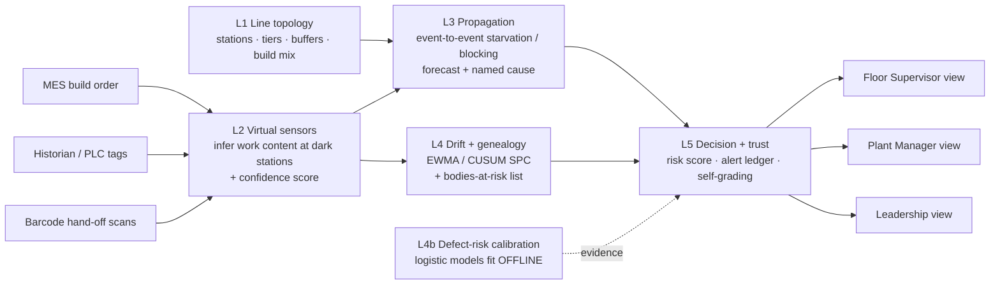

# TwinFlow — Detailed Business Proposal

**Accenture Innovation Challenge 2026 · Round 2 · Track 4: DigitalTwin.ai**

*A predictive digital twin for a mixed-model vehicle assembly line that works with
the sensor coverage a real plant actually has — not an idealised one.*

---

## Executive summary

Plant dashboards report **state** — a buffer level, a cycle time, a fault code. They
do not report **consequence**: *when* that buffer runs dry, *which* upstream station
is responsible, and *how many* bodies already carry a defect that won't be caught
until end-of-line test. Teams therefore react after the end-of-line counter drops,
and trace root cause backwards through a shift's worth of build records.

TwinFlow closes that gap. It runs **read-only** against a plant's existing MES,
historian and barcode scans — no PLC write path, nothing on the line to retrofit on
day one — and turns that feed into three things a dashboard cannot give you:

1. **A forecast with a named cause.** An event-to-event simulation of the line
   predicts the next starvation or blocking event ~170 minutes (median) before a
   specification alarm would fire, and names the upstream station responsible.
2. **Containment instead of recall.** When a process parameter drifts, genealogy
   turns "something is wrong at FA04" into a numbered, ranked list of the specific
   bodies that passed FA04 during the drift — rolled-out vs. still-on-line.
3. **A trust loop.** Every alert is graded TRUE/FALSE against the plant's own
   downtime and quality log as it arrives, and the system raises its own firing
   threshold for any alert type whose measured precision drops below a floor.

One model drives three role-specific applications — Floor Supervisor, Plant Manager,
Leadership. Validated on 8 independently-seeded shifts the twin had never seen:
**100% recall** on every injected fault type, **~98% bottleneck-alert precision**
against the plant's own downtime log, **~170 min median lead** over a spec alarm.
We also show, openly, where it is *not* ahead — the 30-minute output count is roughly
level with a constant-takt baseline on a healthy line. The honest claim is advance
warning with a named cause, not better arithmetic.

---

## 1. Problem framing

### 1.1 The gap

A modern line is heavily measured but thinly *understood*. SCADA shows a station is
blocked; it does not show that the block will stall the constraint station four
positions downstream in 12 minutes, or that the real cause is a fixture drift two
zones upstream that is still inside spec. The information to see that exists — it is
just spread across the historian, the MES build order, and barcode hand-off
timestamps, and nobody is integrating it in real time.

### 1.2 The five constraints we designed around

The Round 2 brief calls these out; each one shaped an architectural decision.

| Real-world constraint | Design consequence |
|---|---|
| **Uneven instrumentation.** Legacy + modern equipment mixed; here ~40% of stations are cycle-only or dark/manual. | The twin must stay useful with partial data. Layer 2 *infers* work content at dark stations from barcode timing + MES build order, and attaches a confidence score to every estimate. A twin that needs full telemetry everywhere is a twin you cannot deploy. |
| **Multi-causal, intermittent, delayed root causes.** Wear, operator variation, upstream part quality, ambient conditions — and a defect created early surfaces only at a late inspection. | Deterministic propagation + statistical process control + genealogy backtrace, so the system names the *true upstream source*, not the symptom station, and flags every body built during the window. A dedicated test slice covers carry-in, zone-wide ambient, intermittent and operator causes. |
| **Live-production risk.** PLC / line-control changes only happen in rare scheduled maintenance windows. | **No write path to any PLC.** Every output is a recommendation with evidence and a named owner. Integration is at the MES / historian / barcode layer only. |
| **Divergent stakeholders.** A floor supervisor needs "now"; a plant manager needs the week; leadership needs the investment case. | One model, three applications with different information architecture and cadence — not one dashboard with three tabs. |
| **Trust is earned or lost fast.** A false defect alarm that never materialises kills floor adoption. | Every alert carries a *falsifier* and a *verify-by* time, is graded against the plant's own outcome record, and the firing threshold self-retunes when precision drops below a floor. Predictive quality is monitored continuously, not asserted once. |

### 1.3 Cost of inaction

For a high-volume line, the recurring losses are: unplanned line stoppage (modelled
here at a contribution cost on the order of hundreds of thousands of dollars per
hour), rework at a few thousand dollars per unit, and the *silent* cost — a drift
that stays inside spec long enough to be built into dozens of bodies before an
inspection catches one, forcing a containment sweep with no list to work from.

---

## 2. Solution design

### 2.1 What it is

A five-layer engine that consumes a normalised event stream — one record per body
per station: `{t, station, unit, variant, zone, tier, scan_ok, cycle_s,
station_time_s, blocked_s, motion_duty, params}` — and emits ranked, evidenced
recommendations. Layers above the topology never reference a station by name; they
work through equipment tier and declared process parameters, so a different plant is
the case the engine was written for, not a port of it.

### 2.2 Architecture



| Layer | Role | Core technique | Why this technique |
|---|---|---|---|
| **L1 — Topology** | 42 stations across body / paint / final; tiers A (full sensors) / B (cycle-only) / C (dark/manual); buffer capacities; three-variant build mix (SEDAN 0.52 / SUV 0.34 / WAGON 0.14). | Declarative JSON, not code. | A new line is *described*, not programmed. Enables Phase 3 scale-out with no engine change. |
| **L2 — Virtual sensors** | Recover work content at dark stations from barcode hand-off timing, conditioned on the MES build order (the same fixture takes longer on a larger body). One EWMA per variant per station, pooled fallback. | Timing-based inference + per-variant smoothing. Every estimate carries a **method-derived confidence**: direct PLC 99%, clean hand-off 85%, camera-assisted 62%, bounded 35%. | The build order is free MES data and recovers ~14% of dark-station accuracy for zero hardware. Confidence lets downstream scoring discount weak evidence rather than trust it blindly. |
| **L3 — Propagation** | A 1-second-tick discrete-event simulation of the line over a 30-minute horizon. Predicts which station starves or blocks, when, and identifies the binding constraint and the upstream station driving it. | **Deterministic physics**, not ML. | Explainable to a supervisor, needs no training data, and transfers to a new line unchanged. The forecast is scaled by the availability the end-of-line counter implies, so it degrades gracefully. |
| **L4 — Drift + genealogy** | EWMA + CUSUM statistical process control with a hold counter on every declared process parameter. Genealogy store maps which bodies passed a drifting station during the drift window → ranked containment list, rolled-out vs. still-on-line. | **SPC**, decades of shop-floor precedent; tunable, transparent. | Catches drift *while it is still inside spec*, and converts it to a bounded inspect-first list instead of an open-ended recall. |
| **L4b — Defect-risk calibration** | Two logistic models: an **origin model** (per-body contributor ranking, used live) and an **alert model** (informational confidence only — *not* a firing gate). | Small, auditable logistic regression, fit **entirely offline** on shifts the live twin never sees; refit per site in ~15 minutes of compute. | Keeps the live decision path free of anything trained on live data, and makes per-site adaptation cheap. |
| **L5 — Decision + trust** | Fuses evidence (discounted by confidence) into a risk score; produces `tier · headline · risk · action · owner · expected impact · falsifier · verify-by`. The **AlertLedger** grades each alert TRUE/FALSE against the plant's own late-arriving downtime/quality log, and raises a type's firing threshold when its lifetime precision sits below a floor. | Rule-based fusion + a closed-loop controller on the threshold. | The system converges on *this plant's* precision baseline instead of inheriting ours, and the loop is the drift monitor for its own alert quality. |

### 2.3 Deterministic logic vs. statistics vs. ML vs. LLM — and why

The brief asks teams to be explicit about this. TwinFlow's decision path contains
**no LLM and no black-box ML**:

- **Deterministic discrete-event simulation** for propagation and forecasting —
  physical, explainable, zero training data, portable.
- **EWMA / CUSUM SPC** for drift detection — standard, tunable, transparent.
- **Offline-fit logistic regression** only for defect-risk *ranking* — auditable
  coefficients, refit per site, and even then the alert model is attached as an
  evidence line, never as a gate.
- **LLM (optional, not in this prototype's critical path):** the only defensible
  use is rendering an already-structured, already-evidenced alert into
  floor-readable phrasing. It is never the source of a number.

### 2.4 Working with uneven sensor coverage

1. **Build order first (zero hardware).** Integrate the MES build order before
   buying a single camera — it recovers ~14% of dark-station work-content accuracy
   because it tells the twin which body it is looking at.
2. **Targeted cameras, not blanket.** The Round 1 pitch proposed a webcam at every
   dark station. The validated sensor sweep says hand-off timing from existing
   barcode scans is sufficient for most dark stations; cameras earn their keep only
   where scan quality is already poor. Recommendation: **2–3 cameras per line**,
   installed in one maintenance window — roughly **70% less hardware spend** than
   blanket coverage.
3. **Confidence, not silence.** A dark station with a weak estimate still
   contributes — as low-confidence evidence the risk score discounts, not as a gap.

### 2.5 Safety-first design (bias to escalate)

- **Recall over precision on defect drift, stated openly.** Every *material* drift
  in validation was caught (100% recall); alert precision on defect drift is low
  by deliberate trade (single-digit to ~mid-20s % depending on the run and bounded
  by how many drifts became gradeable at all). We show both numbers rather than the
  flattering one.
- **Every alert is falsifiable.** It ships with the specific observation that would
  prove it wrong and the time by which that will be known.
- **No autonomous action.** No PLC write path; a licensed human decides.

### 2.6 One model, three views

Built and working in the prototype:

| View | Workspaces | Answers |
|---|---|---|
| **Floor Supervisor** | Overview · Live Line · Alerts · Bottlenecks · Station Detail | "What is wrong right now, and what do I do?" Ranked alerts with action + owner; live 42-station map; current constraint + runway; evidence and containment behind progressive disclosure. |
| **Plant Manager** | Overview (12-col) · Live Performance · Alerts · Bottlenecks · Quality · Diagnostics · Shift History | "Is the plant performing, and where do I spend the next maintenance window?" Cross-shift constraint ledger, recurring bottlenecks, quality-by-origin, alert-precision trend, a what-if cycle-time simulator. |
| **Leadership** | Executive Overview · Model Performance · Reliability · Root Cause · Business Case · Risks | "Does it work, can we trust it, is it worth deploying?" Validation KPIs, the self-retuning precision floor, multi-causal attribution, and a rollout business case editable on the plant's own financials. |

---

## 3. Target users

| User | Primary question | What TwinFlow gives them | Cadence |
|---|---|---|---|
| **Floor supervisor / line lead** | "What's wrong now? What do I act on?" | Ranked alerts (act-now / advise / monitor) with a named action and owner; live line state; constraint + minutes of runway. | Seconds–minutes |
| **Process / quality engineer** | "Which tool, and which bodies?" | Drift evidence (EWMA, CUSUM, baseline, spec limit, consecutive bodies, projected time-to-threshold); genealogy containment list ranked by contributor risk. | Per event |
| **Plant manager** | "Is the plant performing? Where do I intervene?" | Cross-shift constraint ledger, recurring-bottleneck ranking, quality fallout by origin station, alert-precision trend. | Daily / weekly |
| **Maintenance planner** | "What earns the next window?" | Recurring-constraint ranking (a station that binds every shift is a capacity decision; one that binds once is a bad day) + what-if simulator. | Weekly / per window |
| **Plant / manufacturing leadership** | "Does it work? Can we trust it? What's the ROI?" | Validation KPIs vs. the plant's own log, the trust loop, the editable rollout business case. | Monthly / decision points |

**Economic buyer:** Plant Director / VP Manufacturing.
**Champion:** Continuous Improvement / Industry 4.0 lead.
**Blocker to manage:** OT / controls engineering — addressed by the read-only,
no-PLC integration boundary.

---

## 4. Business case and impact

### 4.1 Value levers

| Lever | Mechanism | Validated input |
|---|---|---|
| **Rework avoided** | Drift is contained to a ranked body list *before* the defect propagates to a late inspection point. | Median **124 bodies** on the containment list per contained drift event. |
| **Downtime avoided** | Starvation / blocking is pre-empted; the constraint keeps running. | **~170 min** median lead over a spec alarm; in ~64% of validated cases the spec alarm never fired at all. |
| **Camera capex avoided** | Targeted 2–3 cameras per line instead of blanket coverage. | Sensor sweep shows barcode timing is sufficient for most dark stations. |

### 4.2 Cost model and stated assumptions

These are the prototype's **editable defaults** — illustrative, not a claim about any
real plant. Every figure recomputes on the Leadership → Business Case screen.

| Assumption | Default | Notes |
|---|---|---|
| Revenue per vehicle | $35,000 | Directional per the brief. |
| Rework per unit | $3,500 | |
| Line downtime cost | $420,000 / hr | Contribution-cost basis for a high-volume line. |
| Contained events per shift | 2.5 | **Most sensitive input — replace with the site's rate.** |
| Shifts per year | 750 | |
| Supervisor response time | 30 min | Subtracted from lead-time gain. |
| Rollout: cameras | 3 × $4,500 | vs. 10 blanket. |
| Rollout: integration + software | $60,000 | One-time, per line; falls per line at scale. |

### 4.3 Illustrative value

**Per contained drift event** (defaults, conservative reading):

```
rework avoided   = (fraction of containment list that would have become rework)
                   × bodies protected × rework cost
                 ≈ 0.25 × 124 × $3,500        ≈ $108,000

downtime avoided = expected stoppage duration pre-empted × downtime rate
                 ≈ 30 min × $420,000/hr       ≈ $210,000
                 ─────────────────────────────────────────
value per event  ≈ $320,000
```

*(The prototype's built-in model is more aggressive — it applies rework cost to the
full 124-body list and values the entire lead-time window as avoided downtime,
producing per-shift figures in the seven figures. We deliberately present the
conservative reading here; the point survives either way.)*

**Per line, per year:** even at a conservative **one material contained event per
week**, one line clears **low-to-mid seven figures** of avoided cost against a
one-time rollout of **~$75,000** plus integration effort. The rollout capital is
trivial relative to a single contained event; **the real investment is the
integration effort and the Phase-1 validation period, not the hardware.**

### 4.4 Validation evidence (what the working prototype demonstrates)

Run over **8 independently-seeded shifts the twin never trained on**, graded against
the simulated plant's own downtime and quality log:

| Metric | Result |
|---|---|
| Fault recall (every injected fault type) | **100%** |
| Bottleneck-alert precision | **~98%** |
| Median lead over a spec alarm | **~170 min**; spec alarm never fired in ~64% of cases |
| Median bodies protected per contained drift | **124** |
| Material drift recall | **100%** |
| Dark-station work-content MAE (normal scan quality) | **~4.6 s (~7%)** |
| Buffer-level reconstruction MAE | **~0.6 units** |
| Build-order conditioning gain at dark stations | **~14%**, zero hardware |
| 30-min output forecast | **~6% lower error than a constant-takt baseline when throughput is degraded; roughly level overall; worse on a healthy line** — shown as a split, not a headline |
| Multi-causal slice | Carry-in traced to the *true upstream source*; ambient, intermittent and operator causes detected |

### 4.5 What we do not claim

- That the numbers above transfer to a real line. **The simulator behind them is a
  stand-in, not fitted to production data.** Phase 1 exists to replace every figure
  with the site's own before any alert reaches a supervisor.
- That the twin counts bodies better than multiplying takt by thirty minutes on a
  healthy line — it does not, and the Leadership view says so.
- Non-financial impact we *do* claim: faster root-cause tracing, less firefighting,
  a defensible audit trail, and floor trust earned from a system that corrects its
  own precision.

---

## 5. Phased roadmap

| Phase | Window | Scope | Exit criteria (measured against the plant's own records) |
|---|---|---|---|
| **0 — Scoping & data mapping** | Weeks 0–4 | Pick one line. Map MES / historian / barcode feeds into the event schema. Author the topology file (stations, tiers, buffers, build mix). Extract a baseline downtime / quality log. | Topology file + field mapping validated against a replayed historical shift. |
| **1 — Shadow mode (read-only, one line)** | Months 1–3 | Twin runs live; alerts are logged, **not surfaced**. L4b defect-risk models refit on the site's disjoint history. Alerts graded against the historical downtime / quality log. | Bottleneck-alert precision ≥ target vs. the plant's own log; 100% recall on material drift; forecast MAE characterised and disclosed. |
| **2 — Supervisor rollout + targeted retrofit** | Months 3–6 | Alerts go live on the floor with all three role views. The ledger self-retunes thresholds on the site's precision floor. Retrofit 2–3 cameras only at stations the sensor sweep flags. Change management: shift huddles, "falsifier on every alert", override capture. | Floor adoption (alert-action rate) above threshold; false-alarm rate under the ledger floor; ≥1 documented contained event. |
| **3 — Second line, second plant** | Months 6–18 | New line = new topology file, **not new code**. Models refit per site; the ledger re-converges on each site's own baseline. Thinner-instrumented sites start with wider confidence bands, not fewer features. | Second site reaches Phase-1 exit criteria on its own data within one month of go-live. |
| **4 — Fleet** | 18+ months | Standardised connectors per MES / historian vendor. Central model-ops for offline refits. Cross-plant recurring-constraint benchmarking. | Per-line integration effort trending down; a named model-ops owner in place. |

**Governance gate:** no phase advances without meeting its exit criteria against the
plant's own outcomes. Phase 1 is non-negotiable — nothing reaches a supervisor until
it is validated on that site's data.

---

## 6. Key risks and mitigations

| # | Risk | Impact | Mitigation | Residual |
|---|---|---|---|---|
| 1 | **False alarms erode floor trust** | High | Self-grading ledger auto-raises the firing threshold for any type below its precision floor; a falsifier on every alert; Phase 1 shadow mode before anything is surfaced. | Early-shift under-call on a genuine drift before enough bodies accumulate to prove materiality — disclosed on the Reliability view. |
| 2 | **Inference wrong at dark stations** | Medium | Every estimate carries a method-derived confidence; the risk score discounts low-confidence evidence; build-order conditioning; targeted cameras where scan quality is measurably poor. | "Bounded" (35% confidence) stations stay wide until instrumented. |
| 3 | **Recommendation treated as automatic control** | High | **No PLC write path — full stop.** Every output is score + evidence + named action + owner; a human decides. | None by design. |
| 4 | **Multi-causal / intermittent causes mis-attributed** | Medium | Dedicated hard-cause test slice (carry-in, zone-wide ambient, intermittent, operator); genealogy backtrace names the *true upstream source*, not the symptom station. | Small-sample confidence; ambient drift still over-blames within a zone. |
| 5 | **Simulator numbers don't transfer** | High | Stated explicitly on every relevant screen; Phase 1 replaces them with the site's own; no go-live on an alert type until validated against that plant's log. | None, provided the Phase-1 gate is honoured. |
| 6 | **Integration with legacy OT is hard** | Medium | Read-only at the MES / historian / barcode layer, never OT / PLC; per-vendor connectors standardised in Phase 4. The real per-site cost is the field mapping, and it scales with the number of distinct source systems, not station count. | Sites with no MES build-order feed lose the cheapest accuracy lever (build-order conditioning). |
| 7 | **Model / data drift over time** | Medium | The ledger's continuous self-grading *is* the alert-quality drift monitor; scheduled offline refits of L4b; forecast MAE tracked per shift. | Needs a named model-ops owner from Phase 4 on. |
| 8 | **Data protection / auditability** | Low–Medium | Read-only; no PII (body IDs and process parameters only); every alert and every override retained with its evidence and its later TRUE/FALSE grade. | Retention and access policy to be set per jurisdiction at Phase 0. |

---

## Appendix A — Mapping to the Round 2 brief

| Brief item | Where it is addressed |
|---|---|
| Modelling approach (represent vs. infer) | §2.2 (L1–L2), §2.4 |
| Predictive techniques + validation before trust | §2.2 (L3–L4b), §2.3, §4.4, Phase 1 |
| Handling data gaps / low-cost sensing | §2.4 |
| Distinct views per stakeholder from one model | §2.6, §3 |
| Integration around legacy PLCs / OT without disruption | §1.2, §2.1, Risk 3 & 6 |
| Scalability & ROI across lines / plants / sites | §2.1 (name-free layers), §4, Phases 3–4 |
| Validation against real outcomes / false-alarm trust | §2.5, L5 trust loop, §4.4, Risk 1 |
| Multi-causal / intermittent / delayed root cause | §1.2, §2.2 (L4), §4.4, Risk 4 |
| Deterministic logic vs. stats vs. ML vs. LLM — explicit | §2.3 |
| Phased roadmap, business case, risks & mitigations | §4, §5, §6 |

## Appendix B — Prototype at a glance

- **Engine:** Python (numpy), five layers + offline calibration; hand-rolled
  1-second discrete-event loop (no simpy).
- **Backend:** FastAPI — run-demo, per-unit risk, what-if, validation (SSE),
  cross-shift history, auth.
- **Frontend:** React + TypeScript, one application shell, three role-scoped views
  with progressive disclosure.
- **Calibration:** L4b logistic models fit offline on shifts disjoint from every
  demo and validation run — the live twin only ever *loads* a finished calibration.
- **Repo:** engine, simulator (stand-in plant), validation harness, and the
  dashboard, with `ARCHITECTURE.md` for the full design and `AGENTS.md` for setup.
